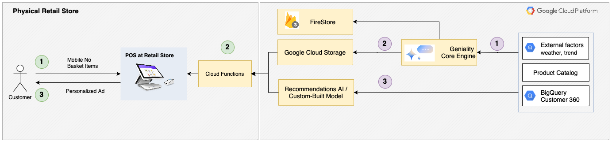
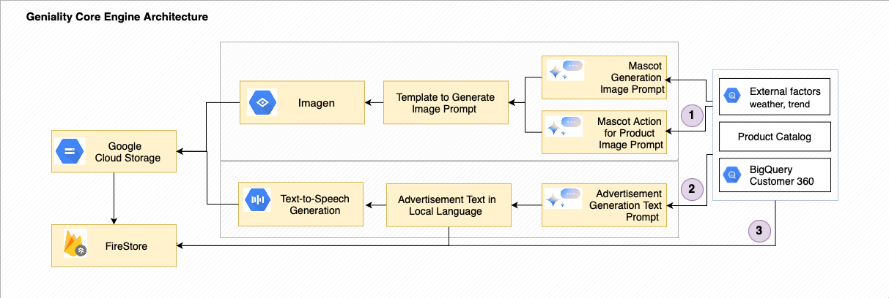
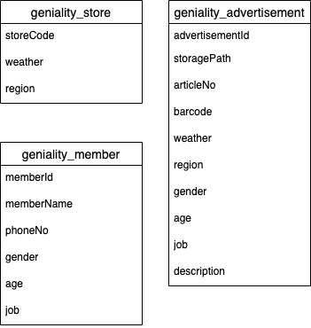
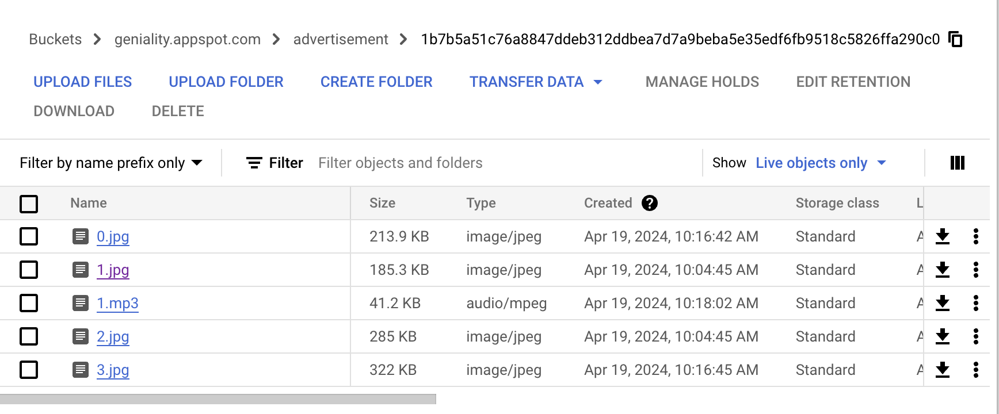
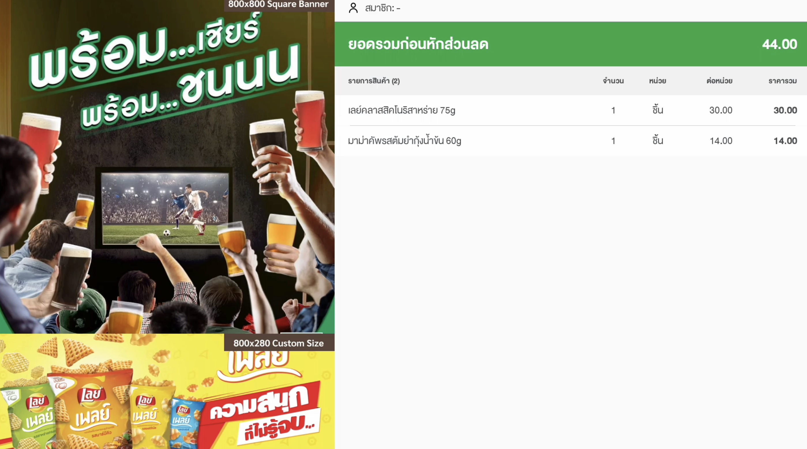
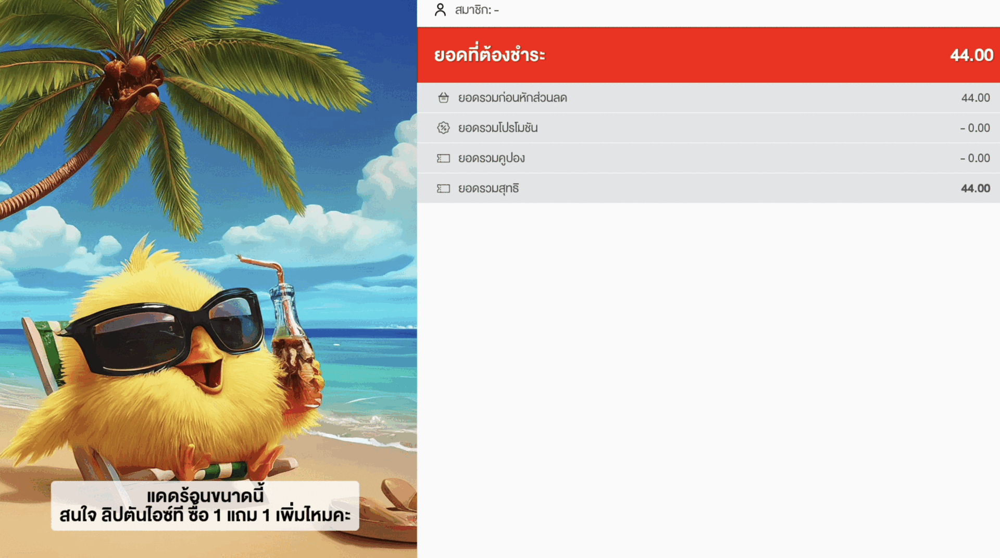

# Geniality: Generative AI for Personalized Marketing using Google Cloud

## Overview
This repository contains a Python-based application designed to demonstrate the capabilities of Google Cloud's AI and generative AI services in generating dynamic marketing content. It automates the creation of advertisements including text, images and audio, leveraging services such as Gemini, Imagen, Text-to-Speech, Vertex AI, Firebase, and Google Cloud Storage. The application is particularly suited for creating customized marketing campaigns based on specific product attributes and environmental factors.


## Architecture
- **Geniality Architecture**:

- **Geniality Core Engine Architecture**:


## Repository Structure

```
.
├── GenAI # Contains the main generative logic (ad_generator.py)
├── images # Architecture diagrams, showcase images, and other related visuals
```
- [`GenAI/ad_generator.py`](GenAI/ad_generator.py): Main Python script containing the logic for generating and managing marketing content.
- [`GenAI/template.env`](GenAI/template.env): Configuration file to manage environment variables.
- [`GenAI/requirements.txt`](GenAI/requirements.txt): Contains all Python dependencies required for the project.
- [`GenAI/README.md`](GenAI/README.md): `.env` Configuration Details.

## Features
- **Content Generation**: Utilize Vertex AI, Imagen, Gemini Pro to generate text and image content.
- **Customer Profiling with External Signals**: Employ external data for detailed customer profiling to enhance targeting.
- **Personalized Real-time Recommendation**: Manage real-time personalized user recommendations.
- **Firebase Integration**: Store and manage advertisement data in Firestore.
- **Google Cloud Storage**: Upload generated images and audio content to Google Cloud Storage.

## Installation and Setup
1. **Environment Setup**:
   - Install Python 3.10 or higher.
   - Install all required Python libraries using:
     ```bash
     pip install -r requirements.txt
     ```
   - Rename the `template.env` to `.env`
   - Configure environment variables in the `.env` file (e.g., `PROJECT_ID`, `FIREBASE_CRED_PATH`).

2. **Firebase Configuration**:
   - Set up a Firebase project and download the credentials file.
   - Update the `FIREBASE_CRED_PATH` in the `.env` file to point to your Firebase credentials file.

3. **Google Cloud Services**:
   - Enable the required APIs (Vertex AI, Google Cloud Storage) on your Google Cloud project.
   - Set up a Google Cloud Storage bucket and update the `BUCKET_NAME` in the `.env` file.

## Usage
Run the `ad_generator.py` script in the GenAI folder to start the generation process:
```bash
python ad_generator.py
```

## Integration with our POS 
Due to confidential materials in our spring boot backend and Android POS, we cannot provide the source code of our backend and Android POS. In this hackathon, we will try to simulate our backend by using the Google cloud function and integrating it with our Android POS.

The general idea of POS integration is that the geniality ai will generate and store the advertisement data in the *geniality_advertisement* collection in firestore. Each advertisement document will be metadata of the advertisement images and audio. The advertisement metadata will be a combination of the following attributes.

1. Weather (SUNNY, RAINY, CLOUDY)
2. Region (NORTH, CENTER, NORTH_EAST)
3. gender (MALE, FEMALE, UNDEFINED)
4. age (YOUTH, ADULT, ELDER)
5. job (WHITE_COLLAR, BLUE_COLLAR, OTHER)

The *geniality_advertisement* will contain the above attributes, advertisement id ,and the storage path of Google storage where the advertiement located.

The *storeagePath* attribute in *geniality_advertisement* collection will be the location of the folder containing image files and audio files of the advertisement.

In order to simulate store and member data, we also create *geniality_store* and *geniality_member* collections. Please note that we already have them currently in our production backend but we cannot provide the detail of our production database schema due to confidential reasons. The *geniality_store* is used to provide the __weather__ and __region__ of the store that the POS is using. The *geniality_member* is used to query member information such as __gender__, __age__ and __job__.

When a customer provides and his or her __phoneNo__, we can find __gender__, __age__ and __job__ from *geniality_member* ,and we also know __weather__ and __region__ from *geniality_store* collection. We can use all of this to query an advertisement from *geniality_advertisement*.

### Data model
We create a very simple model containing 3 collections.



geniality_store
1. *storeCode* the code identifier of store
2. *weather* the weather code. There are 3 codes (SUNNY, RAINY, CLOUDY).
3. *region* the region code There are 3 codes (NORTH, CENTER, NORTH_EAST).

geniality_member
1. *memberId* the member identifier
2. *memberName* the member name
3. *phoneNo* the phone number 
4. *gender* the code of the member gender. There are 3 codes (MALE, FEMALE, UNDEFINED).
5. *age* the code of the member age. There are 3 codes (YOUTH, ADULT, ELDER).
6. *job* the code of the member job. There are 3 codes (WHITE_COLLAR, BLUE_COLLAR, OTHER).

geniality_advertisement
1. *advertisementId* the advertisement identifier
2. *storeagePath* the path to google cloud storage
3. *articleNo* our product article no
4. *barcode* our product barcode
5. *weather* the weather code. There are 3 codes (SUNNY, RAINY, CLOUDY). 
6. *region* the region code There are 3 codes (NORTH, CENTER, NORTH_EAST).
7. *gender* the code of the member gender. There are 3 codes (MALE, FEMALE, UNDEFINED). 
8. *age* the code of the member age. There are 3 codes (YOUTH, ADULT, ELDER).
9. *job* the code of the member job. There are 3 codes (WHITE_COLLAR, BLUE_COLLAR, OTHER).
10. *description* a description text that is shown on an advertisement

### Cloud Storage
In this hackathon, we will create a bucket called "geniality.appspot.com". The management of our files will be like the following convention. 

```
    advertisement/{advertisementId}/{file}
```

All files will be in the advertisement folder and followed by advertisementId where the advertisementId is the advertisement identifier.
The files with extensions .jpg or .png will be considered advertisement images.
The files with extensions .mp3 will be considered advertisement audio.



### Cloud function Overview
There are four functions that we will want to simulate our process. Note that in our product environment, we already have member and recommender API. Unfortunately, we cannot provide the details of them. In this Hackathon, we will mock up member and recommender API in *genialityGetMember* and *genialityRecommender* functions. The *genialityUpdateWeather* is used to update the weather of a store. The *genialityGetAdvertisement* accepts member id and basket items to get advertisement materials from cloud storage.

1. *genialityUpdateWeather* 
   this function is used to change the weather of the store. The weather will change periodically. For instance, if we want to update the weather every hour, we could have a batch job to read the weather from a weather provider and update to *geniality_store*. In this case, this function will be called periodically. We decide to cache the weather on our database rather than querying every time from the weather provider. This decision helps us save costs and also allows more flexible implementation.

2. *genialityGetMember*
   this function is used to get member infomation. A customer provides a phone number and this function will query from *geniality_member*.

3. *genialityRecommender*
   this function is used to get a recommended item according to basket items. For this hackathon, this function is only provide random item.

4. *genialityGetAdvertisement*
   this function is used to get advertisement file according to member id and basket items. This function accepts member id and basket items to get advertisement materials from cloud storage. This is done by querying *geniality_member* and *geniality_store*, and then using basket items to get the recommended item. Finally, we query from *geniality_advertisement*. We now get the path to our cloud storage and list all files in that path. The files that are images (.jpg or .png) will be the advertisement images and the mp3 file will audio file. The description attribute in *geniality_advertisement* will be a description of the function response. 

   This is an example of *genialityGetAdvertisement* response. The items in the images array and audio will be a downloadable link, which is very easy to download from any HTTP client.
```
{
   "advertisement": {
      "images": [
         "https://firebasestorage.googleapis.com/v0/b/geniality.appspot.com/o/advertisement%...",
         "https://firebasestorage.googleapis.com/v0/b/geniality.appspot.com/o/advertisement%...",
         "https://firebasestorage.googleapis.com/v0/b/geniality.appspot.com/o/advertisement%..."
      ],
      "description": "เมื่อฟ้าร้องไห้ มาทำให้ต่อมรับรสของคุณยิ้มได้ด้วยลิปตันแบล็คทีเลมอน รสชาติสดชื่น เหมือนยกแสงแดดมาไว้ในขวด",
      "audio": "https://firebasestorage.googleapis.com/v0/b/geniality.appspot.com/o/advertisement%..."
   }
}
```

### Setup Cloud function
1. Install firebase console
2. Enter to "geniality_functions" folder
3. firebase login
4. firebase deploy --only functions
More info -> https://firebase.google.com/docs/functions/get-started?gen=2nd

### Android POS Integration.
Unfortunately, we cannot provide the source code of our Android POS. We will discuss only the process and how we integrate the POS with the cloud function.

1. Find member. It is very simple. A store cashier asks customer's mobile phone. The POS calls *genialityGetMember* to get member information including memberId. 

2. The POS will get an advertisement using *genialityGetAdvertisement* by providing storeCode, memberId, and basket information. The genialityGetAdvertisement cloud function will return the advertisement description, a downloadable link to a list of advertisement images, and a downloadable link to an advertisement audio (if exists)

   2.1 Add item to basket.
   
   
   2.2 Call *genialityGetAdvertisement* to get an advertisement and show on the customer screeen.
   


## Team Name
Geniality

## Problem Statement
In today's fast-paced digital marketing world, creating engaging and customized content rapidly across multiple platforms can be challenging. Our prototype addresses this issue by automating the generation of advertisement content, including text, images and audio, leveraging AI technologies. This allows businesses to scale their marketing efforts efficiently, reduce the time to market, and maintain relevance in various demographic segments.

## Team Leader Email
nattakarn.ph@tdshop.io

## A Brief of the Ideas
Our project aims to revolutionize the offline retail experience by developing an intelligent system that leverages customer purchase history and profiles to generate accurate personalized recommendations. The system will not only suggest products tailored to individual preferences but will also dynamically create personalized marketing content using GenAI to enhance sales and improve overall customer experience creatively.

### Prototype Description
Our prototype, a comprehensive AI-driven marketing tool, automatically generates tailored advertisement content. It integrates with Google Cloud services like Vertex AI, Imagen, Gemini Pro for Content Generation, Firebase for application data handling, and Google Cloud Storage for storing generated contents. The system extracts relevant text, processes images, and generates engaging multimedia content suited for diverse marketing campaigns.

## Future Scope
The potential for future development of our AI-driven marketing platform is substantial. Key areas for enhancement and expansion include:

1. **External Factors**: Incorporate additional external factors and emerging trends into the recommendation system to elevate the overall customer experience and satisfaction.
2. **Enhanced Interactivity in Content**: Developing interactive content such as quizzes, polls, and dynamic infographics that engage users directly within advertisements can improve user engagement metrics.
3. **Refine Prompt Engineering**: Refine prompts and parameter settings for output consistency and tailor to match individual customer profiles accurately.
4. **Feedback Loop**: Implement feedback loops based on customer reactions and purchase decisions to continually refine recommendations and enhance the GenAI engines.